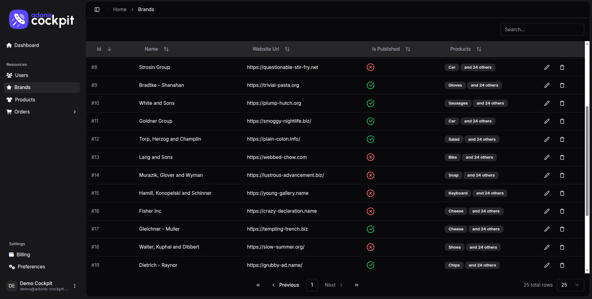

 
  

## The ultimate Admin Panel Builder for [AdonisJS](https://adonisjs.com/)

### Cockpit is the fatest way to build production-ready administration panels with Adonis

 

#### [🚀 Get started](https://adonis-cockpit.com/docs/getting-started/installation) • [🌐 Website](https://adonis-cockpit.com/docs/getting-started/installation) • [✍ Contribute](./CONTRIBUTING.md)

   

## Gettings started

> [!CAUTION]
> This project is in prerelease stage. It might not work as expected and is subject to change.

## License

[MIT licensed](LICENSE.md).
